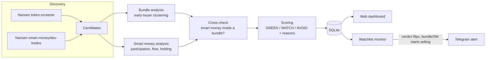
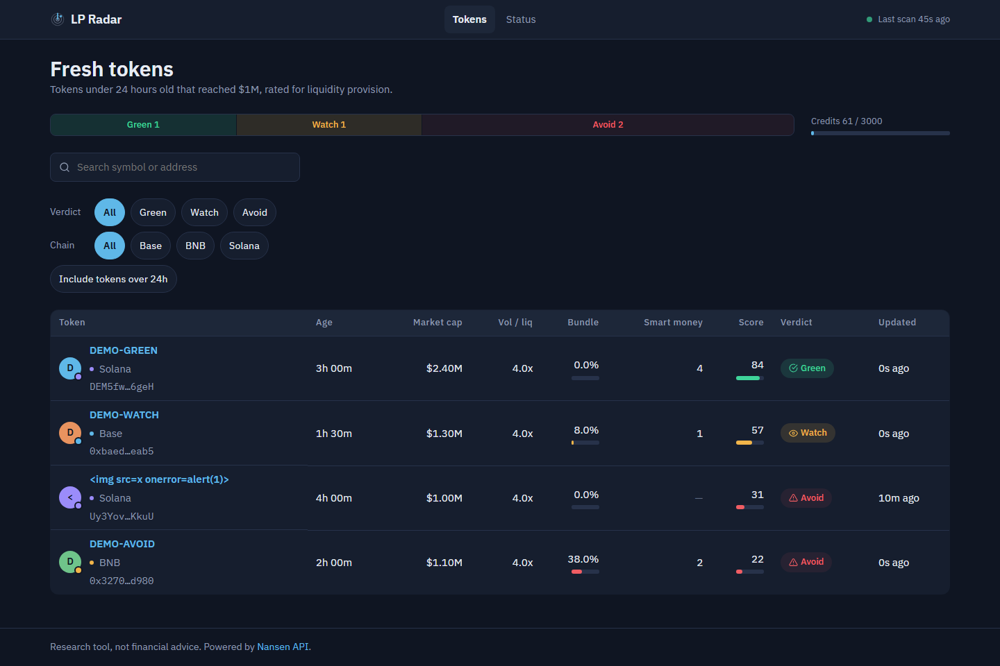
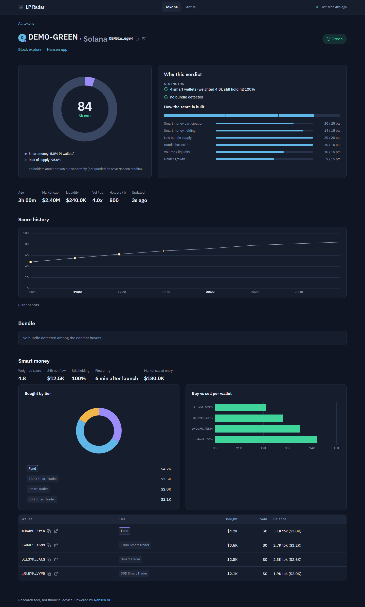
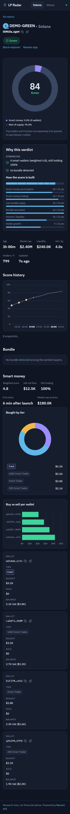

# LP Radar

**A submission for the Nansen Meridian Buildathon.**

LP Radar watches freshly launched tokens (under 24h old, already at $1M+ market cap), checks
whether their early buying looks bundled (a small ring of wallets controlling the supply), checks
what Nansen Smart Money is doing with them, and rates each one as an LP candidate: **GREEN**
(looks clean), **WATCH** (mixed signal), or **AVOID** (bundle risk or smart money selling), with
the specific reasons behind the verdict.

It is read-only: it never holds keys, signs transactions, or trades. It's a research instrument
for someone deciding where to park liquidity, not a bot that acts on their behalf.

**Live dashboard:** https://34-154-8-205.sslip.io **Repo:** this one. **License:** MIT (see `LICENSE`).

## The problem

Fresh, fast-pumping tokens are exactly where liquidity providers get hurt: a handful of wallets
(often coordinated — same funder, same second, suspiciously identical buy sizes) can hold a large
share of supply and dump on LPs the moment they add liquidity. Manually checking a token's early
buyers, whether they're clustered, and whether informed ("smart money") wallets are already in or
already leaving, takes real digging across several tools. LP Radar automates that check and turns
it into one number and a plain-English reason list, refreshed continuously.

## How it works



A polling worker (`app/worker.py`) runs this loop continuously: discovering new candidates and
re-evaluating the existing watchlist each cycle, giving the watchlist priority so an already-
tracked token's re-check never starves behind a burst of new candidates (`docs/worker.md`). A
FastAPI web app (`app/web/`) reads the same SQLite database the worker writes and serves the
dashboard; it never calls Nansen itself.

### Scoring, in brief

Six weighted components (smart money participation, smart money still holding, low bundle supply,
bundle status, volume/liquidity, holder growth) sum to a 0–100 score. Three vetoes force an
automatic **AVOID** regardless of score: bundle holds more than the configured supply threshold,
smart money is net-selling, or a smart-money wallet is itself inside a bundle cluster. Every
threshold lives in `config/scoring.yaml`, tuned against the backtest below, not hand-picked.
Full detail: `docs/scoring.md`, `docs/bundle.md`, `docs/smart-money.md`.

## Nansen endpoints used, and why

All verified live against the current API docs (dates and exact request/response shapes in
`docs/nansen-endpoints.md` — the API changed shape since this was first speced, so that file is
the source of truth, not the original plan).

| Endpoint | Why |
|---|---|
| `token-screener` | Discovery: fresh tokens that pumped to $1M+ market cap within hours of launch. |
| `smart-money/dex-trades` | Discovery's second feed: fresh tokens Nansen-labelled Smart Money wallets are already trading, even before they'd otherwise surface. |
| `tgm/dex-trades` | Every early trade on a candidate token (`block_timestamp` order), the raw material for both bundle detection (who bought in the first N minutes) and smart-money participation. |
| `profiler/address/related-wallets` | Funder clustering: two early buyers funded by the same wallet is one of the three bundle signals. Cached aggressively — 1 credit per wallet looked up. |
| `tgm/holders` | Current supply share of the wallets flagged as a bundle, and (as top holders) a cross-check on smart-money current balances. |
| `tgm/token-information` | Circulating supply and total holder count — the denominator for "bundle holds X% of supply" and the input to the holder-growth-rate score component. |
| `tgm/historical-dex-trades`, `historical-top-holders`, `token-screener/historical` | Beta historical endpoints, used only by the offline backtest (`backtest/`) to score tokens from the past and check whether AVOID tokens actually did worse — never called by the live worker. |

Credits are tracked from every response's own `X-Nansen-Credits-Used` header (never estimated),
capped by a configurable daily budget, and the dashboard's `/status` page shows the running total.
A broader "who are the top holders overall" lookup is deliberately never called during routine
polling, to keep the per-token cost down — the dashboard's supply-ring chart folds that slice into
"rest of supply" with a disclosed note rather than guessing at it. `docs/roadmap.md` records this
as a known simplification, not an oversight.

## Screenshots

Dark, data-forward dashboard: a live-updating token list with sortable columns, verdict counts and
a credit-usage meter; a token detail page built around a supply-ring donut (bundle vs. smart money
vs. everyone else), a stacked "how the score is built" bar, a score-history chart with verdict
threshold bands, and a diverging buy/sell chart per smart-money wallet (click a bar to open that
wallet on its block explorer).

| | |
|---|---|
|  |  |



More at every breakpoint the design was built for: `tests/ui/screenshots/` (regenerate with
`make ui-test`) and as a build artifact on every CI run.

## How to run it

```bash
make install     # create venv, install deps
make check       # ruff + mypy + pytest (replay mode — no live Nansen calls, no credits spent)
make run         # web app locally, replay mode
make worker      # polling worker (writes the SQLite database the web app reads)
```

Seed demo data to try the dashboard without any Nansen credits or a running worker:
`python scripts/seed_demo.py sqlite:///demo.db`, then `DATABASE_URL=sqlite:///demo.db make run` and
open http://127.0.0.1:8000. Details: `docs/dashboard.md`.

UI screenshots and an axe-core accessibility pass (`tests/ui/`) are separate, since they need a
downloaded Chromium: `pip install -e .[ui] && playwright install chromium && make ui-test`.

`make soak` runs the worker for ten real minutes against a scripted Nansen (slow, not part of
`check`). Deploy from scratch (GCP VM, Docker, HTTPS, login, backups): `docs/deploy.md`.

### Backtest (spends real Nansen credits; staged, capped, asks for confirmation)

```bash
python -m backtest.run estimate --limit 15
NANSEN_MODE=live python -m backtest.run discover --max-credits 300
NANSEN_MODE=live python -m backtest.run analyze --limit 3 --max-credits 500
python -m backtest.run report
```

Methodology and every number: `docs/backtest.md`. Results and the headline number: below.

## Backtest results

180 historical tokens scored as if live, then followed for 72 hours to see what actually happened
(full methodology, pre-registered hypothesis tests, and confidence intervals in
`docs/backtest-results.md`):

> **AVOID tokens were dead or collapsed by +72h 68% of the time (84/123, 95% CI 60–76%); GREEN
> tokens, 36% of the time (4/11, 95% CI 15–65%).**
>
> Tokens the scorer called "clean" (no veto, low bundle share, 2+ smart-money wallets holding, no
> net selling) were dead or collapsed 45% of the time (9/20), against 66% for everything else
> (103/155).

The clearest single signal across two independently pre-registered fresh-token batches: having
**zero** smart-money wallets buying in was consistently associated with a worse outcome than
having several (H1, p = 0.003 in the first batch). Not every pre-registered hypothesis held up on
replication — see `docs/backtest-results.md` for the ones that didn't, reported honestly rather
than dropped.

## What it deliberately doesn't do

Execute trades, manage LP positions, or hold keys — v1 scope, unchanged from the original spec.
Show a real per-cluster supply breakdown on the ring chart, do pixel-diff visual regression on the
UI, or migrate the database schema without a manual workaround — three items recorded as genuine
future work, with the specific reason for each, in `docs/roadmap.md`. A light theme was considered
and explicitly skipped, not left half-done.

## Project layout and conventions

See `SPEC.md` for the full original build plan and `CLAUDE.md` for project conventions (how
Nansen endpoints get verified before use, credit-safety rules, testing conventions). Most
subsystems have their own doc under `docs/`: `nansen-endpoints.md`, `scoring.md`, `bundle.md`,
`smart-money.md`, `discovery.md`, `worker.md`, `dashboard.md`, `charts.md`, `ui-testing.md`,
`backtest.md`, `deploy.md`, `roadmap.md`.

`/healthz` reports 503 when the worker heartbeat is stale.
