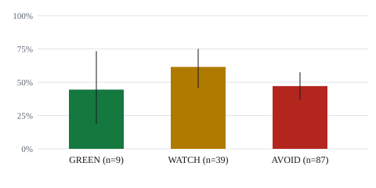

# Backtest results

Generated 2026-09-26 16:46 UTC by `python -m backtest.run report`. 180 tokens analysed, 836 skipped.

## Headline

Dead or collapsed by +72h: AVOID 68% (84/123, 95% CI 60-76%); GREEN 36% (4/11, 95% CI 15-65%).

AVOID tokens fell more than 50% within 24h in 52% of cases (66/127), against 45% for GREEN (5/11).

## Pre-registered checks on fresh tokens

These four checks were written down, with their predicted direction, before the fresh tokens were fetched, and the scoring was left unchanged. H1 and H2 came from looking at the first 83 tokens, so they are hypotheses being tested here on tokens they did not come from. H3 and H4 ask whether the current verdicts and vetoes do anything. Two-sided Fisher exact test; with 4 checks the bar is p < 0.0125. The outcome is dead or collapsed by +72h, using the volume threshold calibrated on the first tokens only (1.6%).

Fresh tokens analysed: 52; with a complete 72-hour window: 52.

| Check | Predicted worse group | Comparison group | p | Result |
|---|---|---|---|---|
| H1 smart money | no smart wallets: 22/27 (81%) | 3+ smart wallets: 3/11 (27%) | 0.003 | supported |
| H2 bundle status | bundle holding: 16/20 (80%) | bundle distributing: 6/15 (40%) | 0.032 | not supported |
| H3 verdicts separate | AVOID: 21/32 (66%) | GREEN or WATCH: 9/20 (45%) | 0.162 | not supported |
| H4 vetoes work | a veto fired: 5/13 (38%) | no veto: 25/39 (64%) | 0.121 | opposite direction |

## Second fresh batch: six pre-registered checks

Written down, with predicted directions, before this batch (`fresh2`, tokens from a window earlier than both previous batches) was fetched; the scoring was left unchanged. H1 to H4 replicate the first fresh batch; H5 and H6 come from looking at the earlier tokens afterwards, so this is their first test on data they did not come from. Two-sided Fisher exact test; with 6 checks the bar is p < 0.0083. The outcome is dead or collapsed by +72h, using the volume threshold calibrated on the pilot tokens only (1.6%).

Tokens analysed: 45; with a complete 72-hour window: 45.

| Check | Predicted worse group | Comparison group | p | Result |
|---|---|---|---|---|
| H1 smart money | no smart wallets: 29/38 (76%) | 3+ smart wallets: 0/2 (0%) | 0.071 | not supported |
| H2 bundle status | bundle holding: 20/22 (91%) | bundle distributing: 10/14 (71%) | 0.181 | not supported |
| H3 verdicts separate | AVOID: 32/40 (80%) | GREEN or WATCH: 1/5 (20%) | 0.014 | not supported |
| H4 vetoes work | a veto fired: 9/11 (82%) | no veto: 24/34 (71%) | 0.699 | not supported |
| H5 pump speed | $1M within 30 min: 23/29 (79%) | slower: 10/16 (62%) | 0.296 | not supported |
| H6 big bundle | bundle 15%+ of supply: 10/11 (91%) | smaller or none: 23/34 (68%) | 0.240 | not supported |

## Lifecycle at +72h

Price alone is a poor test of a volatile new token: many fall by half and come back, and some keep trading at a low price. Each token is followed for 72 hours from the decision and put in one class:

- **dead**: volume in hours 48-72 is below the threshold below (share of the volume in the first 24 hours)
- **collapsed**: the price at +72h is at least 50% below the decision price, and volume is still there
- **recovered**: the price fell at least 50% at some point but ended above that level
- **held**: it never fell that far

### Volume threshold, taken from the data

Tokens are labelled by price only: *rugged* = at least 90% below the decision price at +72h, *survivor* = within 25% of it or above. Volume share = volume in hours 48-72 / volume in the first 24 hours.

- Rugged (65): median 0.0% (range 0.0-2.5%)
- Survivors (79): median 15.5% (range 0.0-287.0%)
- **Threshold: a volume share below 1.8% is called dead.** Balanced accuracy on these tokens: 85%; leave-one-out (each token judged by a threshold that did not use it): 84% over 144 tokens.

### By verdict

|  | Tokens | Dead | Collapsed | Recovered | Held | Dead or collapsed | Fell 50%+ at any time |
|---|---|---|---|---|---|---|---|
| GREEN | 11 | 1 | 3 | 3 | 4 | 36% (4/11, 95% CI 15-65%) | 7/11 |
| WATCH | 41 | 18 | 6 | 6 | 11 | 59% (24/41, 95% CI 43-72%) | 28/41 |
| AVOID | 123 | 75 | 9 | 11 | 28 | 68% (84/123, 95% CI 60-76%) | 79/123 |

### Clean tokens against the rest

Clean = no veto, bundle holding under 5% of supply, at least 2 smart-money wallets, and no net selling by them.

|  | Tokens | Dead | Collapsed | Recovered | Held | Dead or collapsed | Fell 50%+ at any time |
|---|---|---|---|---|---|---|---|
| Clean | 20 | 3 | 6 | 4 | 7 | 45% (9/20, 95% CI 26-66%) | 13/20 |
| Not clean | 155 | 91 | 12 | 16 | 36 | 66% (103/155, 95% CI 59-73%) | 101/155 |

### How much the threshold depends on the labels

| Rugged / survivor cut-offs | Tokens (rugged / survivors) | Threshold |
|---|---|---|
| 80% / 0% | 75 / 60 | 6.2% |
| 80% / 25% | 75 / 79 | 6.2% |
| 80% / 50% | 75 / 86 | 1.8% |
| 90% / 0% | 65 / 60 | 1.8% |
| 90% / 25% | 65 / 79 | 1.8% |
| 90% / 50% | 65 / 86 | 1.8% |
| 95% / 0% | 57 / 60 | 1.8% |
| 95% / 25% | 57 / 79 | 1.8% |
| 95% / 50% | 57 / 86 | 1.8% |

## Outcomes by verdict

"Dumped" means the price fell more than 50% below the price at the decision time within the horizon. Only tokens whose data reaches the horizon are counted.

| Verdict | Tokens | Dumped within 6h | Dumped within 24h | Dumped within 72h | Median max drawdown 24h | Median change +24h | Bundle exited within 24h |
|---|---|---|---|---|---|---|---|
| GREEN | 11 | 27% (3/11, 95% CI 10-57%) | 45% (5/11, 95% CI 21-72%) | 64% (7/11, 95% CI 35-85%) | -49.3% | -41.4% | n/a |
| WATCH | 42 | 24% (10/42, 95% CI 13-39%) | 60% (25/42, 95% CI 44-73%) | 68% (28/41, 95% CI 53-80%) | -76.0% | -47.8% | 0/1 |
| AVOID | 127 | 41% (52/127, 95% CI 33-50%) | 52% (66/127, 95% CI 43-60%) | 64% (79/123, 95% CI 55-72%) | -66.0% | -26.2% | 12/22 |

### Median price change after the decision

| Verdict | +6h | +24h | +72h |
|---|---|---|---|
| GREEN | +11.9% | -41.4% | -47.3% |
| WATCH | +16.6% | -47.8% | -61.3% |
| AVOID | +0.0% | -26.2% | -52.7% |

## Effect of each veto

Dump rate within 24h for tokens that triggered a veto against those that did not.

| Veto | Tokens | With the veto | Without it |
|---|---|---|---|
| `bundle_supply` | 18 | 72% (13/18, 95% CI 49-88%) | 51% (83/162, 95% CI 44-59%) |
| `sm_in_bundle` | 10 | 30% (3/10, 95% CI 11-60%) | 55% (93/170, 95% CI 47-62%) |
| `sm_net_selling` | 21 | 52% (11/21, 95% CI 32-72%) | 53% (85/159, 95% CI 46-61%) |

## Coverage

- Tokens analysed: 180
- Skipped, `never_reached_market_cap`: 756
- Skipped, `trades_truncated`: 80
- Rows stamped after a decision time that were dropped before analysis: 0
- Credits spent on the analysed tokens: 13941

### Smart-money coverage by batch

A check on smart money can only be tested where smart wallets are found. If coverage drops for older windows, the check loses power there without being refuted.

| Batch | Launch days | Tokens | 1+ smart wallet | 3+ smart wallets |
|---|---|---|---|---|
| pilot | 2026-09-10 to 2026-09-23 | 83 | 30 (36%) | 21 (25%) |
| fresh | 2026-08-27 to 2026-09-08 | 52 | 25 (48%) | 11 (21%) |
| fresh2 | 2026-08-13 to 2026-08-26 | 45 | 7 (16%) | 2 (4%) |

## Method and limits

- Candidates: young, liquid tokens from the historical screener, not filtered on market cap (that would hide tokens that pumped and then collapsed).
- Decision time: the close of the first 5-minute candle at or above the market cap threshold within the pump window. Only data up to that moment reaches the analysis.
- Reduced-input score: holder count and liquidity do not exist point-in-time, so those two components are left out and the remaining weights are re-scaled. Verdict thresholds are unchanged.
- Balances are rebuilt from trades between launch and the decision; a wallet with no trades in that window counts as holding nothing.
- Funder lookups use the current related-wallets endpoint; a funding relationship is a permanent on-chain fact, so this does not look ahead.
- All historical endpoints are beta and may be restated. The sample is small and the intervals are wide: treat this as evidence for tuning `scoring.yaml`, not proof.
